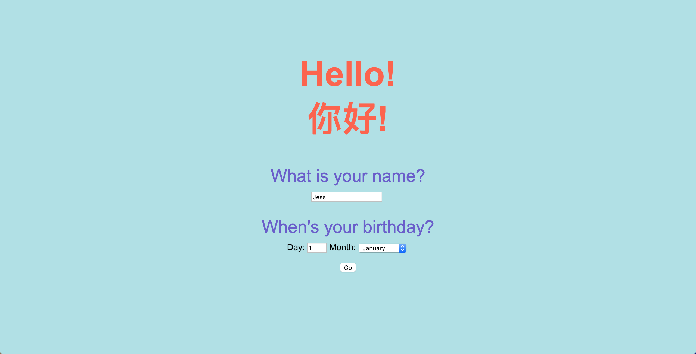
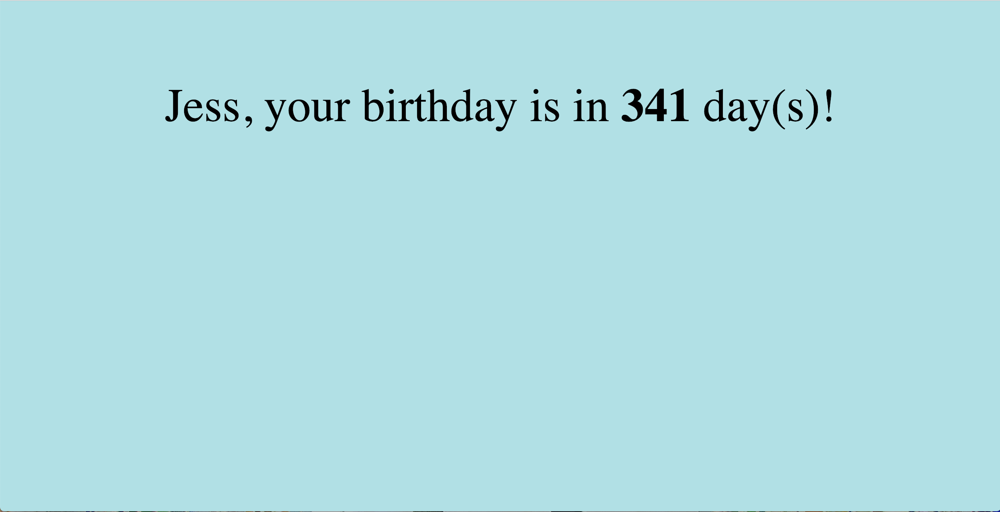
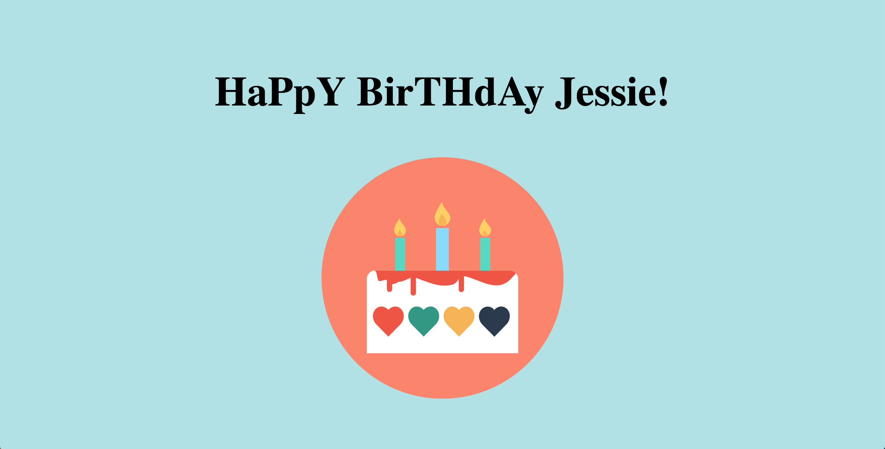

# Birthday Greeter App

In week 3 of Makers course, I built this simple web app test my understanding and practice using the <b>MVC framework</b>.

The instructions (user requirement) can be found [here](https://github.com/makersacademy/course/blob/master/intro_to_the_web/post_challenges/birthday_app.md).

## Approach

First set up environments needed for this project. 
- Web app framework: Synatra
- Test framework: Capybara
- Middleware: Rack

I will (try to) use the <b>TDD</b> approach for this app.

Then I break the user requirements into smaller steps: 
1) Show the greeting on home page  
2) User can fill in their names using the form. 
3) User can tell the app their birthday.  
4) User information will be post to the controller. 
6) Write an algorithm that can do the countdown/ greet the user if it is their birthday. 
5) Redirect the form data to the `/greeting` route. 

NB The algorithm should be in the modeller to keep the controller light.

## Instructions
Enter your name and birthday on home page and click `Go`.

 

You will then see your birthday countdown in days.

 

Or get a greeting if its your birthday!

### Learning Outcome

The primary learning goal is of course to gain hands-on experience of building a web app using the MVC framework and practice <b>automated testing</b>.
The extra gain from this project is <b>HMTL</b> formatting, <b>CSS</b> styling, and the joy from solving the countdown problem.
